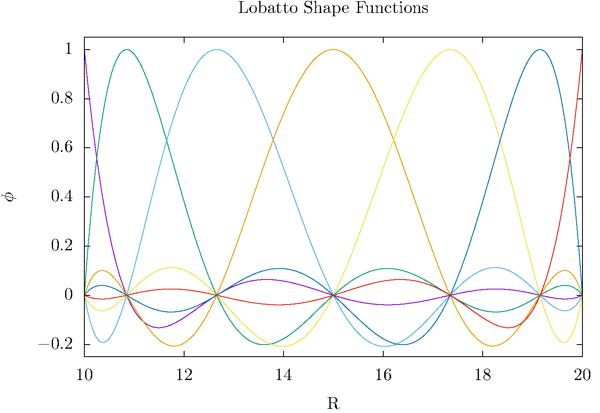
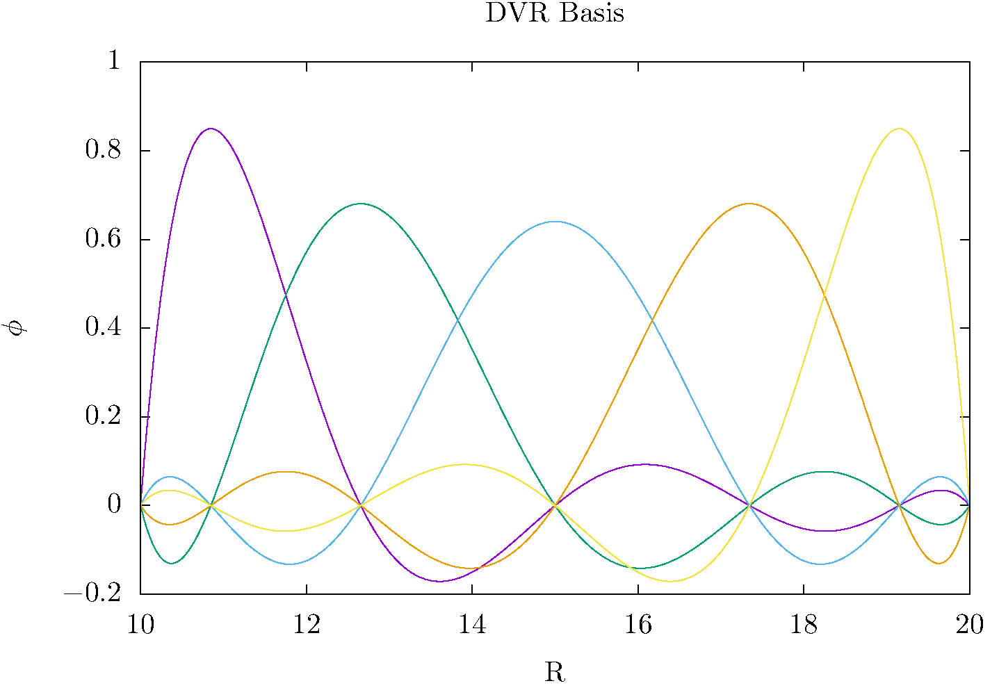
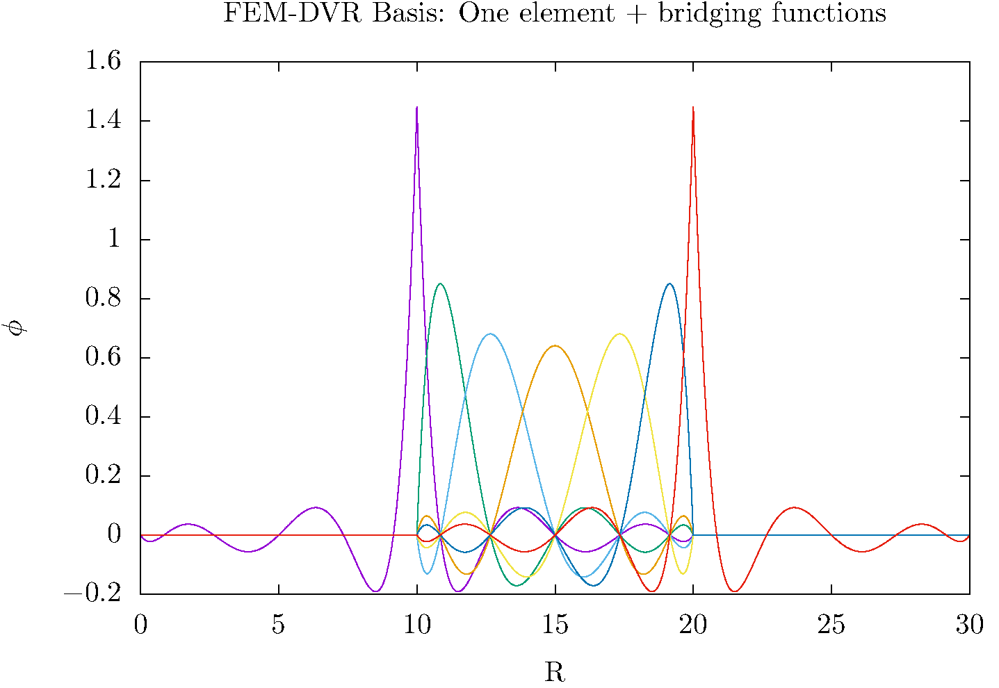
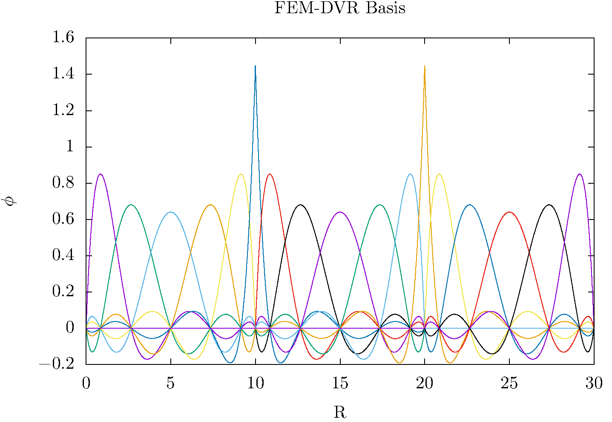

.. role:: bolditalic
   :class: bolditalic

.. role:: bold
   :class: bold

.. role:: italic
   :class: italic

==========
Background
==========

These notes are an introduction to Discrete Variable Representations (DVRs) using an example that has particularly general applicability. The Finite Element Method with a Discrete Variable Representation (FEM-DVR) provides a way to solve the time-independent or time-dependent Schrödinger equation that, like all DVR methods, is more accurate and faster than finite difference. This method is one of a family of Discrete Variable Representations that are in common use today in chemistry and physics. It can be applied to problems with any potential on any interval. These notes explain the FEM-DVR method using Gauss-Lobatto quadrature, and also outline the Crank-Nicolson propagator for solving the time-dependent Schrödinger equation.

Introduction
------------

These notes describe a method for solving the Schrödinger equation for a particle moving in one dimension with coordinate :math:`x` for :bold:`any` potential :math:`V (x)` on :bold:`any` interval of :math:`x`. The variational method of course provides a way to do so, but its application generally poses a practical problem we would like to overcome: If we expand the unknown wave function in :math:`H |\Psi\rangle = E |\Psi\rangle` in a finite set of basis functions

.. math::
  |\Psi\rangle \approx \sum_{n=1}^N c_n |\varphi_n\rangle

substitute it into the Schrödinger equation, and project from the left with :math:`\langle \varphi_m |`, we come quickly to the familiar matrix representation

.. math::
  \mathbf{H}\vec{c} &= E \vec{c} \\
  \textrm{with} \quad H_{mn} &= \langle \varphi_m|\hat{T}|\varphi_n \rangle + \langle \varphi_m|\hat{V}|\varphi_n \rangle

that we can also get from the variational theorem. This is a variational basis representation of the Schrödinger equation.

To construct this matrix eigenvalue problem we need the matrix elements of both the kinetic energy and potential energy operators :math:`\hat{T}` and :math:`\hat{V}`. If we choose a basis for which the kinetic energy matrix elements are easy to evaluate, energy operators T and then try to apply it to solving this problem for various potentials, we generally find that the matrix elements are difficult to perform for many of those potential functions. The DVR is a way of getting around this problem. It is described in an extensive literature on many kinds of DVR that began in the 1980s with seminal work by John Light in the Chemistry Department at the University of Chicago and his coworkers :cite:`LightDVR1986`. The central idea is this: We choose a particular form of basis functions, no matter what the potential, that are constructed based on a Gaussian quadrature. Then we use that Gaussian quadrature to do every integral in the problem ­ of both the kinetic and potential energy operators. The result is that the potential energy matrix is diagonal

.. math::
  \langle \varphi_m|\hat{V}|\varphi_n\rangle = \delta_{nm}V(x_n)

where :math:`x_n` is a Gauss quadrature point. In other words, in this basis set method the potential energy matrix is always diagonal, and :bolditalic:`there are no potential energy integrals to be evaluated`. We only have to evaluate the potential on a grid of quadrature points in :math:`x`. So if we can evaluate the potential energy function as a function of the coordinates, we can reduce the Schrödinger equation directly to a matrix eigenvalue equation. To see how this works we have first to familiarize ourselves with the basics of Gaussian quadrature for performing integrals in general.

Gassian Quadrature
------------------

A Gaussian quadrature is a set of points and weights for approximating an integral as a sum. The most basic example is the Gauss-Legendre quadrature summarized together with many other Gauss quadratures in Abramowitz
and Stegun :cite:`abramowitz+stegun` (the NBS Handbook of Mathematical Functions) starting on page 887, or in the successor to reference :cite:`abramowitz+stegun`, in NIST Digital Library of Mathematical Functions https://dlmf.nist.gov/ chapter 3, section 3.5 on Gauss quadrature (see Eqs. 3.5.15 and 3.5.19)

.. math::
  \begin{eqnarray}
    \int_{-1}^{+1} f(x) dx = \sum_{i=1}^n w_i f(x_i) + R_n \\
   R_n \propto f^{(2n)}(\xi) \qquad \textrm{for some} -1 < \xi < 1
  \end{eqnarray}

the points, :math:`x_i` , are the zeros of the nth order Legendre polynomial :math:`P_n(x)``, and the weights, :math:`w_i` are given by formulas involving the derivative of that polynomial, in this case, :math:`w_i = 2/ ((1 - x_i )^2 [P_n (x_i)]^2)`. The error is proportional to the :math:`2n^{th}` derivative of the integrand. That means that this quadrature is exact if :math:`f(x)` is any polynomial of degree :math:`2n - 1` or lower. This property is at the heart of Gauss quadrature and the DVR method. The quadrature can be scaled onto any finite interval

.. math::
  \begin{eqnarray}
    \int_a^b f(y) dy &= \frac{b-a}{2}\sum_{i=1}^n w_i f(y_i) + R_n \\
    y_i &= \Big(\frac{b-a}{2}\Big)x_i + \Big(\frac{b-a}{2}\Big)
  \end{eqnarray}
  :label: GausLeg

by scaling the points and weights. The Legendre polynomials do not have zeros at the endpoints of the interval [-1, 1], so all the quadrature points at any order are interior to that interval. For our DVR we need to have points in the quadrature at the endpoints of the interval, because that is where we have to apply the boundary conditions of the Schrödinger equation. That quadrature is called the Gauss-Lobatto quadrature :cite:`abramowitz+stegun`,

.. math::
  \begin{eqnarray}
    \int_{-1}^{+1} f(x) dx = \frac{2}{n(n-1)}[f(-1) + f(1)] + \sum_{i=2}^{n-1} w_i f(x_i) + R_n \\
    R_n \propto f^{(2n)}(\xi) \qquad \textrm{for some} -1 < \xi < 1
  \end{eqnarray}

which can of course be written in the form of Eq. :eq:`GausLeg` with the same scaling. The only difference is that before the scaling the first and last points are explicitly :math:`-1` and :math:`+1`, with the weights :math:`\frac{2}{n(n -1)}`. There are algorithms for computing the remaining Gauss- Lobatto points and weights at any order, and those are available in C, C++, Fortran and Python libraries. Fixing the two endpoints to be quadrature points lowers the accuracy of the quadrature. It now quadratures polynomials of degree up to :math:`2n-3` exactly. We will use the Gauss-Lobatto quadrature here, but there are many other Gauss quadratures. In general they quadrature integrals of the form

.. math::
  \int_a^b f(x) W(x) dx = \sum_{i=1}^{n} w_i f(x_i) + R_n

with some positive definite weight function :math:`W(x)`. For example if :math:`a = -\infty` and :math:`b = \infty`, with the weight function :math:`W = e^{-x^2}`, the quadrature is based on Hermite polynomials and is called Gauss-Hermite quadrature. See Abramowitz and Stegun :cite:`abramowitz+stegun` for a summary of eight common quadratures. Of course, there is a Wikipedia page too.

DISCRETE VARIABLE REPRESENTATION OF THE WAVE FUNCTION AND HAMILTONIAN
---------------------------------------------------------------------

The Gauss-Lobatto quadrature points provide a way to construct :math:`n` polynomials of degree :math:`n - 1` called "interpolating polynomials" that are each zero at all but one of the quadrature points,

.. math::
  L_j(x) = \prod_{i \ne j}^n \frac{x-x_i}{x_j-x_i}
  :label: interp

and are equal to 1 at :math:`x = x_j` . So if we have the values of a function at the quadrature points we can interpolate it by effectively fitting it with Nth order polynomials as

.. math::
  f(x) \approx \sum_{j=1}^n f(x_j) L_j(x)

this fit reproduces the function exactly at the quadrature points, and provides a polynomial interpolation between them. This kind of interpolation, using interpolating poynomials of the form of Eq. :eq:`interp`, the starting idea of the DVR and also the start of the derivation of quadrature rules like Simpson's rule that involve evenly (or unevenly) spaced quadrature points. To form our DVR basis functions, :math:`\phi_j(x)`, we know normalize these interpolating polynomials by multiplying by :math:`1/\sqrt{w_j}`,

.. math::
  \phi_j(x) = \frac{1}{w_j^{1/2}}\prod_{i \ne j}^n \frac{x-x_i}{x_j-x_i}
  :label: DVRbasis

These functions are now normalized in the very specific sense that they are orthonormal :bolditalic:`within the quadrature approximation`

.. math::
  \int_a^b \phi_i(x) \phi_j(x) dx \approx \sum_{k=1}^n w_k \phi_i(x_k) \phi_j(x_k) = \delta_{ij}

The central idea of a DVR using the Gauss-Lobatto quadrature is to
  1. Expand our unknown wave function in these Gauss-Lobatto basis functions and then
  2. Define every matrix element as its approximation by the underlying Gauss-Lobatto quadrature

The idea of using the Gauss-Lobatto quadrature to define a DVR was introduced by Manolopoulos and Wyatt :cite:`Manolopoulos1988,Manolopoulos1989` in 1989. It allows us to apply boundary conditions at the two endponts, a and b of the interval on which the quadrature is defined. We will apply the boundary conditions that the wave function is zero at the endpoints, which we can accomplish by simply excluding from the basis the basis functions that are nonzero at first and last of the quadrature points. We expand the wave function in the DVR basis

.. math::
  \Psi(x) = \sum_{m=2}^{n-1} \psi_m\phi_m(x)

where the unknown coefficients are related to the values of the wave function :math:`\Psi(x)` at the grid points by :math:`\psi_m = \Psi(x_m)w_m^{1/2}`. Then the matrix of the kinetic energy is

.. math::
  \begin{align}
    T_{i,j} &= -\frac{\hbar^2}{2m}\int_a^b\phi_i(x)\frac{d^2}{dx^2}\phi_j(x)dx \\
            &= \frac{\hbar^2}{2m} \int_a^b \frac{d}{dx}\phi_i(x) \frac{d}{dx}\phi_j(x)dx \\
            &= \sum_{k=2}^{n-1}w_k\phi_i'(x_k)\phi_j'(x_k)
  \end{align}
  :label: KE

where we integrated by parts and use the boundary condition we are applying to get an obviously symmetric matrix result. We can see that the integrand in Eq. :eq:`KE` is of order :math:`2(n - 2) = 2n - 4`. That's because the order of the interpolating polynomials in Eq. :eq:`interp` is :math:`n-1`, and so their derivatives are of order :math:`n-2`. Thus the Gauss-Lobatto quadrature, which integrates polynomials of order :math:`2n-3`, is :bold:`exact` for the kinetic energy.

For the potential energy we have

.. math::
  V_{i,j} &= -\frac{\hbar^2}{2m}\int_a^b\phi_i(x)V(x)\phi_j(x)dx \\
          &\approx \sum_{k=2}^{n-1} w_k \phi_i(x_k)V(x_k)\phi_j(x_k) = \delta_{i,j}V(x_i)

The potential matrix is diagonal because the DVR basis functions are at all the quadrature points but one. That has to be the same point for the two basis functions, or else the integral is zero. With this DVR, the time-independent Schrödinger equation has been reduced to a matrix equation

.. math::
  \mathbf{H}\vec{\psi} &= E\vec{\psi}  \\
  \textrm{with} \quad H_{ij} &= T_{ij} + V_{ii} \delta_{ij}

The kinetic energy matrix is full and is treated exactly. The potential energy matrix elements are approximated by the quadrature. To improve the approximation we increase the order of the quadrature. We only require the values of the potential at the quadrature points, and once we have the coefficients we can scale them so that the function  to be normalized.

DVRs are a popular numerical approach in one or more dimensions. The sort of DVR described here can be used for the angular degrees of freedom in spherical polar coordinates, for example, with the change of variable x = cos . To increase the accuracy of the DVR basis set representation of the wave function one only needs to increase the order of the underlying quadrature.

For large intervals in x and wave functions with short wavelengths, we might need many hundreds or thousands of grid points. In this approach, that would mean calculating the points and weights to high precision for a quadrature that might of the order of thousands. To escape that problem, there is a popular variant of this method called the FEM-DVR.

FINITE-ELEMENT METHOD WITH DISCRETE VARIABLE REPRESENTATION
-----------------------------------------------------------

In this method, first proposed by Rescigno and McCurdy :cite:`Rescigno_McCurdy2000` in 2000, we divide up the interval in x into sub-intervals call finite elements. With each of those elements we associate a separate Gauss-Lobatto quadrature and a separate DVR basis constructed according to Eq. :eq:`DVRbasis`. However, we must pay special attention to the boundaries between the elements. To allow the wave function to be continuous across the finite element boundaries we must include the Lobatto shape functions that we eliminated above, and that are nonzero at the ends of the finite element interval. To do so, we start by labeling the Lobatto-shape functions according to which interval, :math:`\alpha`, they are associated with

.. math::
   L_j^\alpha(x) =
   \begin{cases}
     \prod_{i \ne j}^n \frac{x-x_i^\alpha}{x_j^\alpha-x_i^\alpha} & x_1^\alpha \le x \le x_n^\alpha \\
     0 & x < x_1^\alpha, \quad x_n^\alpha < x
   \end{cases}
   :label: FEMLobatto

and similarly labeling the DVR basis functions

.. math::
  \phi_j^\alpha(x) = \frac{1}{(w_j^\alpha)^{1/2}}  L_j^\alpha(x) \qquad 2 \le j \le n-1
  :label: FEMbasis

We can then create bridging functions that connect the elements :math:`\alpha` and :math:`\alpha+1` according to

.. math::
  \phi_n^\alpha(x) = \frac{1}{\sqrt{w_n^\alpha + w_1^{\alpha+1}}}\left(L_n^\alpha(x) + L_1^{\alpha+1}(x) \right)
  :label: FEMDVRbasis

The bridging functions are normalized, because they are integrated by the combination of the quadratures in the two finite elements.

This idea is illustrated in the figures directly above. The bridging functions extend across two elements, while the FEM-DVR basis within each element is nonzero only on that interval.

We can extend this process to create as many elements as we want. So for example, we might use 20th order quadrature in each element and have 100 elements of various sizes cover the entirety of the interval :math:`a \le x \le b`.

Rescigno and McCurdy~\cite{Rescigno_McCurdy2000} give the formulas for the kinetic energy matrix elements for this method, which are still exactly evaluated by the Gauss-Lobatto quadrature(s) over the entire domain of :math:`x`. The potential matrix elements remain diagonal. The kinetic energy is no longer a full matrix, but has the form of overlapping blocks originating from their finite elements. Schematically we can display the form of the Hamiltonian for four elements as

.. math::
  \begin{eqnarray}
  \\
  \mathbf{H} = &\mathbf{T} &+\qquad \qquad \qquad \mathbf{V} \\
  \\
  \mathbf{H} =&
   \begin{pmatrix}
     X&X&0&0&0&0&0&0&0 \\
      X&X&X&X&0&0&0&0&0 \\
     0& X&X&X&0&0&0&0&0\\
     0& X&X&X&X&X&0&0&0\\
     0& 0&0&X&X&X&0&0&0\\
     0& 0&0&X&X&X&X&X&0\\
     0& 0&0&0&0&X&X&X&0\\
     0& 0&0&0&0&X&X&X&X\\
     0& 0&0&0&0&0&0&X&X\\
   \end{pmatrix}
   &+
   \begin{pmatrix}
     X&0&0&0&0&0&0&0&0 \\
     0&X&0&0&0&0&0&0&0 \\
     0&0&X&0&0&0&0&0&0 \\
     0&0&0&X&0&0&0&0&0 \\
     0&0&0&0&X&0&0&0&0 \\
     0&0&0&0&0&X&0&0&0 \\
     0&0&0&0&0&0&X&0&0 \\
     0&0&0&0&0&0&0&X&0 \\
     0&0&0&0&0&0&0&0&X \\
   \end{pmatrix}
  \end{eqnarray}

where there are four blocks in the kinetic energy matrix, the first and last of which are smaller than all the intermediate blocks, because the lack the first and last basis functions that would have been nonzero at the boundaries of the entire interval in :math:`x`.

The FEM-DVR basis is orthogonal within the overall Gauss-Lobatto quadrature. The kinetic energy matrix is exactly evaluated with the quadrature. The potential energy is only required at the quadrature points,

.. math::
   \begin{equation}
   \langle \phi_i |V|\phi_j \rangle = \delta_{ij}V(x_i)
   \end{equation}

The DVR representation not variational because both the potential and overlap matrix elements are approximated by the quadrature and are not exact, although with moderately dense grids that property barely noticeable.  Also, the FEM-DVR enforces only continuity at the finite element boundaries and not continuity of the derivatives of the wave function. Therefore there is first order error at each finite element boundary. Again, with moderately dense grids the discontinuity in the derivative at the boundaries is very slight and causes no numerical pathologies.

:bold:`Higher dimensions:` Extension of both the DVR and FEM-DVR methods to higher dimensions is straightforward.  Suppose we had a problem with :math:`x` and :math:`y` degrees of freedom. In a product basis of separate DVR basis functions :math:`\phi_i(x)` and :math:`\chi_m(y)` the kinetic and potential energy matrices are

.. math::
  \begin{equation}
   \begin{split}
     T_{im,jn} &=\langle \phi_i(x) \chi_m(y) |T_x + T_y| \phi_j(x) \chi_n(y) \rangle = \delta_{mn}T^x_{ij} +\delta_{ij}T^y_{mn}  \\
     V_{im,jn} &= \langle \phi_i(x) \chi_m(y) |V(x,y) | \phi_j(x) \chi_n(y) \rangle = \delta_{ij} \delta_{mn} V(x_i,y_m)
   \end{split}
  \end{equation}

and extentions to higher dimensions are similar. One only needs the potential evaluated at the quadrature points, and the kinetic energy matrix becomes increasingly sparse as the number of dimensions increases.  Scalable algorithms for implementing the FEM-DVR in higher dimensions take advantage of that sparsity, both in storage and numerical operations.

DVRs constructed from other orthogonal polynomials and the notion of a "proper DVR"
-----------------------------------------------------------------------------------

Orthogonal polynomials tridiagonalize the matrix of the position with the weight with which the orthogonal polynomials are orthogonal

.. math::
  \begin{equation}
    Q_{i,j} = \int_a^b \phi_i(x) \, x \, \phi_j(x) \, W(x) dx = \textrm{tridiagonal matrix}
  \end{equation}

That is an essential property that is derivable from the three-term recursion relations satisfied by all orthogonal polynomials. Every set of orthogonal polynomials defines a quadrature for their values of :math:`a`, :math:`b` and :math:`W(x)`. For example we can construct a DVR for the interval :math:`-\infty < x < \infty` using harmonic oscillator functions that apply the proper bound-state boundary conditions at infinity, and the underlying quadrature will be the Gauss-Hermite quadrature as described in the appendices of reference :cite:`bec00:1`.

If we begin with a real  orthogonal basis :math:`\{\phi_i(x)\}_{i=1}^{N}` that tridiagonalizes the position operator, :math:`x`, we can generate a "proper DVR", in the terminology of the appendices of the review article :cite:`bec00:1` by Hans Dieter-Meyer and coworkers, as follows.

1. Diagonalize the matrix of the position operator :math:`\mathbf{Q}`

.. math::
  \begin{equation}
     Q_{i,j} = \langle \phi_i|x|\phi_j\rangle \\
     \mathbf{Q}=\mathbf{U}\mathbf{X}\mathbf{U}^T
  \end{equation}

where :math:`\mathbf{X}` is the matrix of position eigenvalues :math:`X_{\alpha,\beta} = x_\alpha \delta_{\alpha,\beta}`

2. Transform the exactly evaluated matrix of the kinetic energy, :math:`\mathbf{T}` to the basis of position eigenfunctions

.. math::
  \begin{equation}
    T^{DVR}=\mathbf{U}^T \mathbf{T} \mathbf{U}
  \end{equation}

3. Construct the DVR representation of the Hamiltonian as

.. math::
  \begin{equation}
    H^{DVR}_{\alpha,\beta} = T^{DVR}_{\alpha,\beta}+V(x_{\alpha})\delta_{\alpha,\beta}
  \end{equation}
  \label{eq:DVRham}

in which the potential is diagonal, so no matrix elements of it are required.

The DVR basis in which the Hamiltonian is represented by :math:`H^{DVR}` is

.. math::
  \begin{equation}
    \chi_\alpha(x) = \sum_{j=1}^N \phi_j(x)U_{j,\alpha}
  \end{equation}

These functions also provide the "interpolating basis" mentioned below.

Because the original basis tridiagonalized the position operator, we can construct the underlying Gauss quadrature, whose abscissas are :math:`\{x_\alpha\}_{\alpha=1}^N`, and whose weights are given by

.. math::
  \begin{equation}
    w_\alpha^{1/2}=U_{k,\alpha} / \phi_k(x_\alpha)
  \end{equation}

which in this case does not depend on :math:`k`.  If the original basis had not tridiagonalized :math:`x` this formula for the weights would have depended on :math:`k`.

In a proper DVR we can use the properties of the underlying Gauss quadrature to show that the original basis satisfied :bold:`discrete orthonormality`

.. math::
  \begin{equation}
    \sum_{\alpha = 1}^N w_\alpha \phi_j (x_\alpha) \phi_k(x_\alpha) = \delta_{j,k}
  \end{equation}

and :bold:`discrete completeness`

.. math::
  \begin{equation}
    \sum_{j = 1}^N (w_\alpha w_\beta)^{1/2} \phi_j (x_\alpha) \phi_j(x_\beta) = \delta_{\alpha,\beta}
  \end{equation}

:italic:`The combination of these two properties means that the the DVR and an expansion of the wave function in the original orthogonal polynomials are exactly equivalent.`

Moreover the DVR basis in a proper DVR has the important discrete :math:`\delta` -property

.. math::
  \begin{equation}
    \chi_\alpha(x_\beta) = w_\alpha^{-1/2}\delta_{\alpha,\beta}
  \end{equation}

This relation tells us that for any function spanned by the original basis we have, using the quadrature,

.. math::
  \begin{equation}
    \langle \chi_\alpha|\psi \rangle = w_\alpha^{1/2} \psi(x_\alpha)
  \end{equation}

So that if we find the eigenvectors of  :math:`\mathbf{H}^{DVR}` or use it in the DVR representation of linear equations like :math:`(E-\mathbf{H}^{DVR})\boldsymbol{\psi} = \mathbf{d}`,  the resulting vectors represent the values of :math:`\psi` on the gridpoints

.. math::
  \begin{equation}
     \psi(x) \rightarrow \boldsymbol{\psi}=(w_1^{1/2}\psi(x_1),w_2^{1/2}\psi(x_2),\cdots,w_N^{1/2}\psi(x_N))
  \end{equation}

Equally important is the fact that the DVR basis provides the :italic:`interpolating basis` whereby we can get :math:`\psi` at any value of $x$ via its expansion

.. math::
  \begin{equation}
    \psi(x) = \sum_{\alpha=1}^N \psi_\alpha \chi_\alpha(x)
  \end{equation}

:bold:`Note:` If the original basis does not tridiagonalize the position operator, but instead tridiagonalizes an invertable function of :math:`x`, like :math:`1/x` or :math:`(x_0-x)^2`, a proper DVR can be generated by diagonalizing that operator, and writing the abscissas :math:`x_\alpha` in terms of the eigenvalues of that operator.

Time propagation using the FEM-DVR and Crank-Nicolson propagator
----------------------------------------------------------------

Finite difference in time as a route to approximate solutions of the time-dependent Schrödinger equation
~~~~~~~~~~~~~~~~~~~~~~~~~~~~~~~~~~~~~~~~~~~~~~~~~~~~~~~~~~~~~~~~~~~~~~~~~~~~~~~~~~~~~~~~~~~~~~~~~~~~~~~~~~

The time-dependent Schrödinger equation has been converted by our DVR to a time-dependent matrix equation (:math:`\hbar = 1`),

.. math::
  \begin{equation}
    i\frac{\partial}{\partial t} \vec{\psi}(t) = \mathbf{H}(t) \, \vec{\psi}(t)
  \end{equation}

which is of course an initial value problem. The simplest way to treat it is by approximating the derivative by finite difference,

.. math::
   \begin{equation}
     \begin{split}
       i \frac{\vec{\psi}(t+\Delta) - \vec{\psi}(t)}{\Delta} \approx  \mathbf{H}(t)\, \vec{\psi}(t) \\
       \textrm{or}\quad \vec{\psi}(t+\Delta) = \left(1-i\Delta \mathbf{H}(t)\right) \vec{\psi}(t)
     \end{split}
   \end{equation}

which would allow us to step forward in time with a single matrix multiplication.  Unfortunately this idea, known as "forward Euler", produces an unstable algorithm, whose error, depending on the spectrum of :math:`\mathbf{H}` (its eigenvalues) grows exponentially. There are many ways to remedy this problem at the cost of more matrix multiplications per step, and several of them can be derived by using higher order finite difference approximations to first derivative involving more points in time. Standard methods, like the variable time-step Runge-Kutta method, and various "predictor-corrector" methods can be found in the literature and software libraries.

A propagator that has the particularly important advantage for quantum mechanics of being unitary is due to Crank and Nicolson~ :cite:`Crank1996` (whose original paper was about heat-conduction equations).  We can " derive" it easily by replacing the right hand side by an average of it evaluated at :math:`t` and :math:`t+\Delta`

.. math::
  \begin{equation}
   \begin{split}
     i \frac{\vec{\psi}(t+\Delta) - \vec{\psi}(t)}{\Delta} & \approx \frac{1}{2} \left( \mathbf{H}(t+\Delta)\, \vec{\psi}(t+\Delta) +\mathbf{H}(t)\, \vec{\psi}(t))\right) \\
     &\approx \frac{1}{2} \left( \mathbf{H}(t+\Delta/2)\, \vec{\psi}(t+\Delta) +\mathbf{H}(t+\Delta/2)\, \vec{\psi}(t))\right) \\
     \textrm{or}\quad  \left(1 + i\frac{\Delta}{2} \mathbf{H}(t+\Delta/2)\right) & \vec{\psi}(t+\Delta) = \left(1 - i \frac{\Delta}{2} \mathbf{H}(t+\Delta/2)\right) \vec{\psi}(t)
   \end{split}
  \end{equation}

We can write the Crank-Nicolson propagator result in two equivalent forms,

.. math::
  \begin{equation}
  \boxed{
  \begin{split}
   \left(1 + i\frac{\Delta}{2} \mathbf{H}(t+\Delta/2)\right) \vec{\psi}(t+\Delta) &= \left(1 - i \frac{\Delta}{2} \mathbf{H}(t+\Delta/2)\right) \vec{\psi}(t) \\
   \vec{\psi}(t+\Delta) =  \left(1 + i\frac{\Delta}{2} \mathbf{H}(t+\Delta/2)\right)^{-1}  &   \left(1 - i \frac{\Delta}{2} \mathbf{H}(t+\Delta/2)\right) \vec{\psi}(t) \\
  \end{split}
  }
  \end{equation}
  :label: CN

Implementing the first relation in Eq. :eq:`CN` to take a time step requires one matrix multiplication plus a single solution of linear equations.  It is one of a class of "implicit" methods that require a solution of linear equations in contrast to "explicit" methods that require only matrix-vector multiplications.  Solving the linear equations is the most efficient implementation of the Crank-Nicolson propagator if the Hamiltonian is time dependent, because solving one set of linear equations requires much less computation than inverting a matrix. If the Hamiltonian is not time dependent however we can construct the inverse once and for all and use it to take any number of time steps, which then only require one matrix-vector multiplication each.

.. math::
  \begin{equation}
   \begin{split}
      \mathbf{U} =  \left(1 + i\frac{\Delta}{2} \mathbf{H}\right)^{-1}  &   \left(1 - i \frac{\Delta}{2} \mathbf{H}\right) \\
      \vec{\psi}(t+\Delta) &=  \mathbf{U}\vec{\psi}(t) \\
      \vec{\psi}(t+n \Delta) &=  \mathbf{U}^n\vec{\psi}(t) \quad \textrm{for }\mathbf{H} \, \textrm{ time-independent}
    \end{split}
  \end{equation}
  :label: CN2

A single matrix inversion and matrix-matrix multiplication then allows us to take $n$ time steps with only n matrix-vector multiplications.

Properties of the Crank-Nicolson propagator
~~~~~~~~~~~~~~~~~~~~~~~~~~~~~~~~~~~~~~~~~~~

  1. :bold:`Unitarity:`  Crank-Nicolson propagation is unitary, meaning that for each time step the norm of the wave function is conserved. The reason is that the matrix :math:`\mathbf{U}` is unitary, including the case that :math:`H` is time-dependent. Proof uses the fact that  :math:`H` is hermitian, :math:`H^\dagger = H`:

.. math::
  \begin{equation}
   \begin{split}
     \mathbf{U}&=\left(1+i\frac{\Delta}{2}\mathbf{H}(t+\Delta/2)\right)^{-1} \left(1- i\frac{\Delta}{2}\mathbf{H}(t+\Delta/2)\right) \\
     \mathbf{U}^\dagger& =  \left(1+ i\frac{\Delta}{2}\mathbf{H}^\dagger \right) \left(1-i\frac{\Delta}{2}\mathbf{H}^\dagger\right)^{-1}
      =  \left(1+ i\frac{\Delta}{2}\mathbf{H} \right) \left(1-i\frac{\Delta}{2}\mathbf{H} \right)^{-1} \\
     \mathbf{U} \mathbf{U}^\dagger =& \left(1+i\frac{\Delta}{2}\mathbf{H}\right)^{-1} \left(1- i\frac{\Delta}{2}\mathbf{H}\right)
                                  \left(1+ i\frac{\Delta}{2}\mathbf{H}\right) \left(1-i\frac{\Delta}{2}\mathbf{H}\right)^{-1}  \\
                            =&       \left(1+i\frac{\Delta}{2}\mathbf{H}\right)^{-1} \left(1+ i\frac{\Delta}{2}\mathbf{H}\right)
                                  \left(1- i\frac{\Delta}{2}\mathbf{H}\right) \left(1-i\frac{\Delta}{2}\mathbf{H}\right)^{-1}
                                  \textrm{H commutes with itself and 1} \\
                                &  = 1
   \end{split}
  \end{equation}

So :math:`\vec{\psi} (t+\Delta)^\dagger \cdot \vec{\psi}(t+\Delta)= \vec{\psi}(t)^\dagger \mathbf{U}^\dagger  \cdot \mathbf{U} \vec{\psi}(t) = \vec{\psi}(t)^\dagger \cdot \vec{\psi}(t)` and the norm of the wave function is preserved at every step.

2. :bold:`Error is third order:` The order of the error in the Crank-Nicolson propagator is :math:`\Delta^3`, as we see by expanding in powers of :math:`\Delta` and comparing with the expansion of :math:`\exp(-i\mathbf{H}\Delta)`,

.. math::
  \begin{equation}
   \begin{split}
     \mathbf{U}&=\left(1+i\frac{\Delta}{2}\mathbf{H}\right)^{-1} \left(1- i\frac{\Delta}{2}\mathbf{H}\right) \\
     &= \left(1 - i\frac{\Delta}{2}\mathbf{H} +(i\frac{\Delta}{2}\mathbf{H})^2 -(i\frac{\Delta}{2}\mathbf{H})^3\cdots\right) \left(1- i\frac{\Delta}{2}\mathbf{H}\right) \\
     &= 1 - i\mathbf{H}\Delta +\frac{1}{2} \left(- i\mathbf{H}\Delta \right)^2 + O(\Delta^3) \\
     &= e^{-i\mathbf{H} \Delta} + O(\Delta^3)
   \end{split}
  \end{equation}

3. :bold:`Stability:`  The Crank-Nicolson propagator is unconditionally stable, meaning that no matter what the step size and spectrum of :math:`\mathbf{H}(t)` the error of the propagation does not increase exponentially as for forward Euler.

References
----------

.. bibliography:: _static/refs_background.bib
  :style: unsrt
