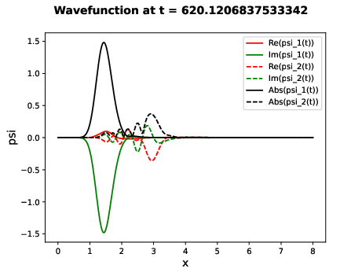
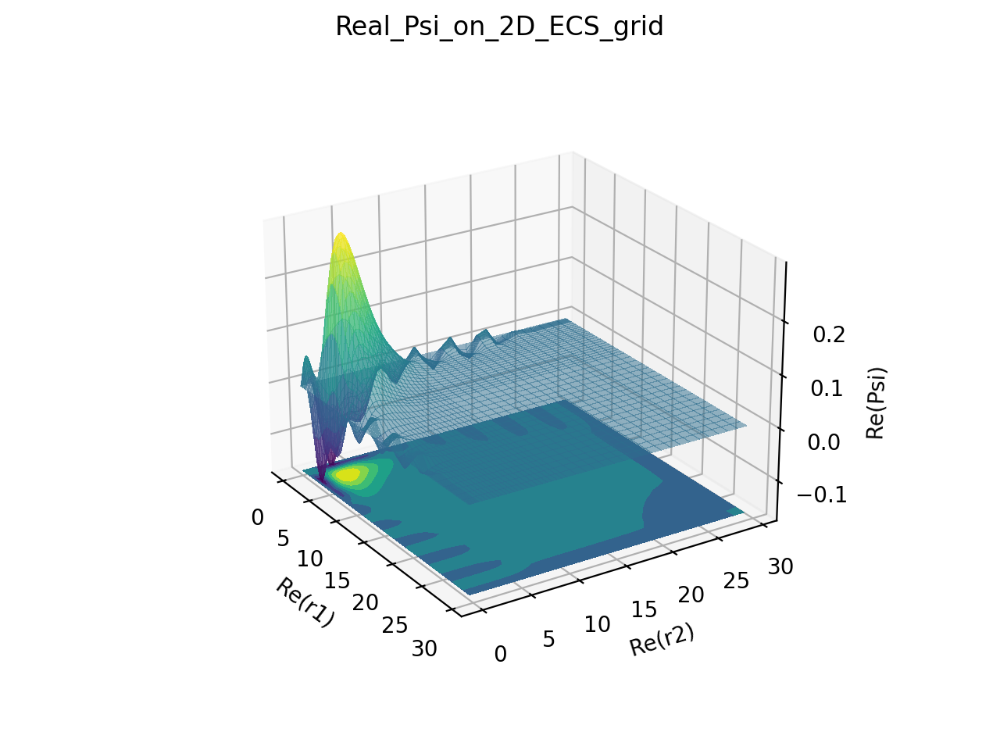

.. raw:: html

   <h1 align="center">
     💥quantumGrid💥
   </h1>

.. raw:: html

   

     
   

Brought to you by the AMO theory group at Berkeley National Lab.

Note:
  The image above is for a scattered wave on a 2D FEM-DVR grid which was created with POV-Ray. The next two figures were created with the example scripts time_dep_two_potential_excitation and two_electron, respectively.

.. toctree::
   :maxdepth: 2
   :caption: Contents:

   readme
   installation
   background
   usage
   modules
   examples
   contributing
   authors
   history

Indices and tables
==================
* :ref:`genindex`
* :ref:`modindex`
* :ref:`search`
